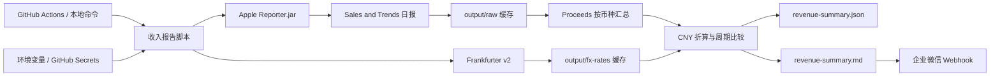

# 架构与数据流

项目由一个无状态入口脚本、两个本地缓存目录和一个通知出口组成。除缓存和最终报告外，认证材料只存在于环境变量或运行期临时文件中。

## 数据流

## 主要组件

### Reporter 客户端

- 从 Apple 官方地址下载并校验 `Reporter.jar`。
- 使用 Robot XML 模式下载 Summary Sales Report。
- Access Token 写入权限为 `0600` 的临时 properties 文件。
- 临时目录在客户端退出时清理。
- 对 Apple 的可重试错误和网络超时执行有限重试。

### 报表解析

- 同时接受 gzip 和未压缩 UTF-8 TSV。
- 按列名解析，不依赖固定列位置。
- 逐行计算 `Units × Developer Proceeds`。
- 按 `Currency of Proceeds` 聚合，保留退款的负数影响。

### 汇率层

- 从 Frankfurter v2 获取历史日汇率。
- 按报表月生成并冻结 CNY 管理汇率。
- 缓存已有币种；出现新币种时只补充缺失汇率。
- 汇率缺失时失败，不产生不完整总额。

### 报告层

- 为四个当前窗口和四个上一窗口计算 CNY 总额。
- JSON 保留原币金额、实际汇率、覆盖率和比较明细。
- Markdown 只突出 CNY 金额、上一周期和涨跌幅。

### 通知层

- 只接受 `qyapi.weixin.qq.com` 的 HTTPS Webhook。
- 检查 Webhook 路径与 `key` 参数。
- 按 UTF-8 字节数拆分超长 Markdown。
- 对网络错误和可重试 HTTP 状态执行有限重试。

## 缓存策略

| 路径 | 内容 | 是否敏感 | 生命周期 |
| --- | --- | --- | --- |
| `.cache/apple-reporter/Reporter.jar` | 已校验 Apple Reporter | 否 | 可重新下载 |
| `output/raw/*.tsv.gz` | Apple 原始销售日报 | 是 | 建议私有保存 |
| `output/fx-rates/*.json` | 月度冻结汇率 | 否 | 支持结果复算 |
| `output/revenue-summary.*` | 汇总结果 | 是 | 按组织策略保存 |

GitHub Actions 使用滚动 Cache 恢复 `output/raw` 和 `output/fx-rates`，并把整个 `output/` 上传为 Artifact。

## 信任边界

- Apple Reporter：销售数据权威来源，但仍是趋势用预估值。
- Frankfurter：管理汇率来源，不用于最终财务结算。
- GitHub Secrets 或本地环境：认证材料来源。
- 企业微信 Webhook：外部写入出口，只有显式提供 `--send-wecom` 才调用。

## 设计约束

- Reporter 日报固定使用 Pacific Time。
- Apple 不提供任意日期范围的 Summary Sales Report。
- 180 天逐日缓存用于保证滚动窗口与上一等长周期精确。
- 项目不把没有日报的日期自动解释为接口错误；Reporter 错误码 `213` 通常代表当天没有销售单位。
